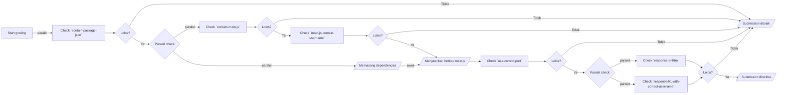

# Autograder - (Nama Autograder)

> Autograder untuk kelas [X](https://www.dicoding.com/academies/x)

## Table of Content

- Setup Autograder
- Cara Menjalankan Autograder
- Flowchart (alur dalam menilai submission)
- Roadmap
- Acceptance Scenarios
- Appendix

## Setup Autograder

*TODO: Jelaskan cara setup proyek autograder (misal, install dependencies, dsb)*

## Cara Menjalankan Autograder

*TODO: Jelaskan cara menjalankan autograder termasuk flag-flag yang disediakan.*

## Flowchart (alur dalam menilai submission)




## Roadmap checklist

> _Tandai x setiap kali checklist telah selesai._

- [x] Mendefinisikan Acceptance Scenarios (AS)
- [x] Mendefinisikan Flowchart (alur dalam menilai submission)
- [ ] Pengembangan
    - [ ] Memastikan kontrak autograder
    - [ ] Teruji (AS terpenuhi)
    - [ ] Integrasi Logging
- [ ] Melengkapi Dokumentasi
- [ ] Integrasi dengan Platform Dicoding
    - [ ] Teruji secara staging
    - [ ] Dijalankan secara production

## Acceptance Scenarios

Berikut beberapa skenario (baik negatif dan positif) yang ditangani oleh autograder.

### Kriteria: Contains package.json

#### Skenario 1: Ketika submission siswa tidak memiliki berkas `package.json`, submission harus ditolak

- Status: `backlog`

- Test coverage: 🔴

- Expected output:

  ```json
  {
    "is_passed": false,
    "message": "<p>kami tidak bisa menemukan file <strong>package.json</strong> pada submission yang kamu kirimkan, perlu diingat pada umumnya aplikasi Node.js memiliki file package.json untuk menyimpan konfigurasi filenya.</p>"
  }
  ```
  
### Skenario 2: Ketika submission memiliki berkas `package.json`, kriteria `contain-package-json` harus terpenuhi

- Status: `backlog`

- Test coverage: 🔴

- Expected output:

  ```json
  {
    "checklist_keys": ["contain-package-json"]
  }
  ```

### Kriteria: Contains a main.js file

#### Skenario 1: Ketika submission siswa tidak memiliki berkas `main.js`, submission harus ditolak

- Status: `backlog`

- Test coverage: 🔴

- Expected output:

  ```json
  {
    "is_passed": false,
    "message": "<p>kami tidak bisa menemukan file <strong>main.js</strong> pada submission yang kamu kirimkan. Periksa kembali submissionmu pastikan sesuai dengan kriteria yang ada.</p>"
  }
  ```

#### Skenario 2: Ketika submission siswa memiliki berkas `main.js`, kriteria `contain-main-js` harus terpenuhi

- Status: `backlog`

- Test coverage: 🔴

- Expected output:

  ```json
  {
    "checklist_keys": ["contain-main-js"]
  }
  ```

### Kriteria: The main.js file must contain a comment with the student's username

#### Skenario 1: Ketika berkas main.js tidak memiliki komentar username pengirim, submission harus ditolak

- Status: `backlog`

- Test coverage: 🔴

- Expected output:

  ```json
  {
    "is_passed": false,
    "message": "<p>Pastikan kamu menuliskan username akun Dicoding dalam bentuk komentar di berkas <code>main.js</code></p>"
  }
  ```

#### Skenario 2: Ketika berkas main.js memiliki komentar username pengirim, kriteria `main-js-contain-username` harus terpenuhi

- Status: `backlog`

- Test coverage: 🔴

- Expected output:

  ```json
  {
    "checklist_keys": ["main-js-contain-username"]
  }
  ```

### Kriteria: The port must be set to 5000.

#### Skenario 1: Ketika berkas main.js dieksekusi dan port 9000 tidak terbuka, submission harus ditolak

- Status: `backlog`

- Test coverage: 🔴

- Expected output:

  ```json
  {
    "is_passed": false,
    "message": "<p>Pastikan PORT 9000 digunakan oleh aplikasi webmu ketika kami menjalankan berkas <code>main.js</code>.</p>"
  }
  ```

#### Skenario 2: Ketika berkas main.js dieksekusi dan port 9000 terbuka, kriteria `use-correct-port` harus terpenuhi

- Status: `backlog`

- Test coverage: 🔴

- Expected output:

  ```json
  {
    "checklist_keys": ["use-correct-port"]
  }
  ```

### Kriteria: The root of the main.js application must display HTML.

#### Skenario 1: Ketika mengunjungi localhost:9000 tetapi response-nya bukan HTML, submission harus ditolak

- Status: `backlog`

- Test coverage: 🔴

- Expected output:

  ```json
  {
    "is_passed": false,
    "message": "<p>Aplikasi web yang kamu buat harus me-response dengan format HTML.</p>"
  }
  ```

#### Skenario 2: Ketika mengunjungi localhost:9000 dan response-nya HTML, kriteria `response-in-html` harus terpenuhi

- Status: `backlog`

- Test coverage: 🔴

- Expected output:

  ```json
  {
    "checklist_keys": ["use-correct-port"]
  }
  ```

### Kriteria: The HTML file must contain an h1 element with the student's username.

#### Skenario 1: Ketika HTML response bukan elemen h1, submission harus ditolak

- Status: `backlog`

- Test coverage: 🔴

- Expected output:

  ```json
  {
    "is_passed": false,
    "message": "<p>Respone HTML harus berupa element h1.</p>"
  }
  ```

#### Skenario 2: Ketika HTML response elemen h1, tetapi kontennya bukan username siswa, submission harus ditolak

- Status: `backlog`

- Test coverage: 🔴

- Expected output:

  ```json
  {
    "is_passed": false,
    "message": "<p>Konten yang berada di dalam elemen h1 harus username akun Dicodingmu.</p>"
  }
  ```

#### Skenario 3: Ketika response element h1 dan kontennya username siswa, kriteria `response-h1-with-correct-username` harus terpenuhi

- Status: `backlog`

- Test coverage: 🔴

- Expected output:

  ```json
  {
    "checklist_keys": ["response-h1-with-correct-username"]
  }
  ```
  
### Scenario: Rejection and Approval Scenario

#### Skenario 1: Ketika kriteria yang terpenuhi tidak lengkap, submission harus ditolak
- Status: `backlog`

- Test coverage: 🔴

- Expected output:

  ```json
  {
    "is_passed": false,
    "checklist_keys": ["response-h1-with-correct-username", "use-correct-port", "main-js-contain-username"]
  }
  ```

#### Skenario 2: Ketika kriteria yang terpenuhi lengkap, submission harus diterima
- Status: `backlog`

- Test coverage: 🔴

- Expected output:

  ```json
  {
    "is_passed": true,
    "checklist_keys": ["response-h1-with-correct-username", "use-correct-port", "main-js-contain-username", "contain-main-js", "contain-package-json"]
  }
  ```


## Appendix

*TODO: Jelaskan informasi lain yang diperlukan di sini, seperti daftar dependencies, hasil riset, dan lain sebagainya.*