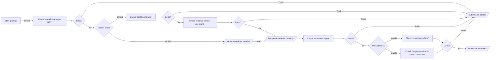

# Autograder - (Nama Autograder)

> Autograder untuk kelas [X](https://www.dicoding.com/academies/x)

## Table of Content

- Setup Autograder
- Cara Menjalankan Autograder
- Flowchart (alur dalam menilai submission)
- Roadmap
- Acceptance Scenarios
- Appendix

## Setup Autograder

- Pastikan komputer Anda sudah terpasang Node.js.
- Clone repository ini.
- Pasang dependencies yang dibutuhkan dengan perintah: npm ci.
- Jalankan pengujian dengan npm test dan pastikan seluruh pengujian lolos.

## Cara Menjalankan Autograder

Jalankan auto-grader dengan menggunakan command npm run start -- [argument]

### Argument

```shell
Options:
      --help     Show help                                             [boolean]
      --version  Show version number                                   [boolean]
  -p, --path     Define student submission location                    [required]
```

### Docker version
```shell
docker pull ghcr.io/dicodingacademy/axxx-autograder-sample-js:master
docker run --rm --mount type=bind,source=$(SUBMISSION_FOLDER_PATH),target=/home/direviu/app/student-submission  ghcr.io/dicodingacademy/axxx-autograder-sample-js npm start -- -p=/home/direviu/app/student-submission
```

## Flowchart (alur dalam menilai submission)




## Roadmap checklist

> _Tandai x setiap kali checklist telah selesai._

- [x] Mendefinisikan Acceptance Scenarios (AS)
- [x] Mendefinisikan Flowchart (alur dalam menilai submission)
- [x] Pengembangan
    - [x] Memastikan kontrak autograder
    - [x] Teruji (AS terpenuhi)
    - [x] Logging
- [x] Melengkapi Dokumentasi
- [ ] Integrasi dengan Platform Dicoding
    - [ ] Teruji secara staging
    - [ ] Dijalankan secara production

## Acceptance Scenarios

Berikut beberapa skenario (baik negatif dan positif) yang ditangani oleh autograder.

### Kriteria: Contains package.json

#### Skenario 1: Ketika submission siswa tidak memiliki berkas `package.json`, submission harus ditolak

- Status: `done`

- Test coverage: 🟢

- Expected output:

  ```json
  {
    "is_passed": false,
    "message": "<p>kami tidak bisa menemukan file <strong>package.json</strong> pada submission yang kamu kirimkan, perlu diingat pada umumnya aplikasi Node.js memiliki file package.json untuk menyimpan konfigurasi filenya.</p>"
  }
  ```
  
### Skenario 2: Ketika submission memiliki berkas `package.json`, kriteria `contain-package-json` harus terpenuhi

- Status: `done`

- Test coverage: 🟢

- Expected output:

  ```json
  {
    "checklist_keys": ["contain-package-json"]
  }
  ```

### Kriteria: Contains a main.js file

#### Skenario 1: Ketika submission siswa tidak memiliki berkas `main.js`, submission harus ditolak

- Status: `done`

- Test coverage: 🟢

- Expected output:

  ```json
  {
    "is_passed": false,
    "message": "<p>kami tidak bisa menemukan file <strong>main.js</strong> pada submission yang kamu kirimkan. Periksa kembali submissionmu pastikan sesuai dengan kriteria yang ada.</p>"
  }
  ```

#### Skenario 2: Ketika submission siswa memiliki berkas `main.js`, kriteria `contain-main-js` harus terpenuhi

- Status: `done`

- Test coverage: 🟢

- Expected output:

  ```json
  {
    "checklist_keys": ["contain-main-js"]
  }
  ```

### Kriteria: The main.js file must contain a comment with the student's username

#### Skenario 1: Ketika berkas main.js tidak memiliki komentar username pengirim, submission harus ditolak

- Status: `done`

- Test coverage: 🟢

- Expected output:

  ```json
  {
    "is_passed": false,
    "message": "<p>Pastikan kamu menuliskan username akun Dicoding dalam bentuk komentar di berkas <code>main.js</code></p>"
  }
  ```

#### Skenario 2: Ketika berkas main.js memiliki komentar username pengirim, kriteria `main-js-contain-username` harus terpenuhi

- Status: `done`

- Test coverage: 🟢

- Expected output:

  ```json
  {
    "checklist_keys": ["main-js-contain-username"]
  }
  ```

### Kriteria: The port must be set to 9000.

#### Skenario 1: Ketika berkas main.js dieksekusi dan port 9000 tidak terbuka, submission harus ditolak

- Status: `done`

- Test coverage: 🟢

- Expected output:

  ```json
  {
    "is_passed": false,
    "message": "<p>Pastikan PORT 9000 digunakan oleh aplikasi webmu ketika kami menjalankan berkas <code>main.js</code>.</p>"
  }
  ```

#### Skenario 2: Ketika berkas main.js dieksekusi dan port 9000 terbuka, kriteria `use-correct-port` harus terpenuhi

- Status: `done`

- Test coverage: 🟢

- Expected output:

  ```json
  {
    "checklist_keys": ["use-correct-port"]
  }
  ```

### Kriteria: The root of the main.js application must display HTML.

#### Skenario 1: Ketika mengunjungi localhost:9000 tetapi response-nya bukan HTML, submission harus ditolak

- Status: `done`

- Test coverage: 🟢

- Expected output:

  ```json
  {
    "is_passed": false,
    "message": "<p>Aplikasi web yang kamu buat harus me-response dengan format HTML.</p>"
  }
  ```

#### Skenario 2: Ketika mengunjungi localhost:9000 dan response-nya HTML, kriteria `response-in-html` harus terpenuhi

- Status: `done`

- Test coverage: 🟢

- Expected output:

  ```json
  {
    "checklist_keys": ["use-correct-port"]
  }
  ```

### Kriteria: The HTML file must contain an h1 element with the student's username.

#### Skenario 1: Ketika HTML response bukan username siswa, submission harus ditolak

- Status: `done`

- Test coverage: 🟢

- Expected output:

  ```json
  {
    "is_passed": false,
    "message": "<p>Konten yang berada di dalam elemen h1 harus username akun Dicodingmu.</p>"
  }
  ```

#### Skenario 3: Ketika response element h1 dan kontennya username siswa, kriteria `response-h1-with-correct-username` harus terpenuhi

- Status: `done`

- Test coverage: 🟢

- Expected output:

  ```json
  {
    "checklist_keys": ["response-h1-with-correct-username"]
  }
  ```
  
### Scenario: Rejection and Approval Scenario

#### Skenario 1: Ketika kriteria yang terpenuhi tidak lengkap, submission harus ditolak
- Status: `done`

- Test coverage: 🟢

- Expected output:

  ```json
  {
    "is_passed": false,
    "checklist_keys": ["response-h1-with-correct-username", "use-correct-port", "main-js-contain-username"]
  }
  ```

#### Skenario 2: Ketika kriteria yang terpenuhi lengkap, submission harus diterima
- Status: `done`

- Test coverage: 🟢

- Expected output:

  ```json
  {
    "is_passed": true,
    "checklist_keys": ["response-h1-with-correct-username", "use-correct-port", "main-js-contain-username", "contain-main-js", "contain-package-json"]
  }
  ```


## Appendix

### Package dependencies
- `esprima-extract-comments`: extract the comment to evaluate student's username
- `zx`: for better child process creation
- `yargs`: for better cli argument getter

### Test Coverage
```text
> axxx-autograder-sample@1.0.0 test
> vitest --run --coverage --no-file-parallelism


 RUN  v2.0.5 /home/dimas/auto-graders/axxx-autograder-sample
      Coverage enabled with v8

 ✓ src/grader.test.ts (14) 32984ms
 ✓ src/report.test.ts (2)
 ✓ src/utils.test.ts (6) 3657ms

 Test Files  3 passed (3)
      Tests  22 passed (22)
   Start at  14:52:46
   Duration  37.02s (transform 84ms, setup 0ms, collect 140ms, tests 36.65s, environment 0ms, prepare 55ms)

 % Coverage report from v8
---------------------------------------|---------|----------|---------|---------|-------------------
File                                   | % Stmts | % Branch | % Funcs | % Lines | Uncovered Line #s 
---------------------------------------|---------|----------|---------|---------|-------------------
All files                              |     100 |      100 |     100 |     100 |                   
 src                                   |     100 |      100 |     100 |     100 |                   
  grader.ts                            |     100 |      100 |     100 |     100 |                   
  report.ts                            |     100 |      100 |     100 |     100 |                   
  utils.ts                             |     100 |      100 |     100 |     100 |                   
 src/criterias                         |     100 |      100 |     100 |     100 |                   
  contain-main-js.ts                   |     100 |      100 |     100 |     100 |                   
  contain-package-json.ts              |     100 |      100 |     100 |     100 |                   
  main-js-contain-username.ts          |     100 |      100 |     100 |     100 |                   
  response-h1-with-correct-username.ts |     100 |      100 |     100 |     100 |                   
  response-in-html.ts                  |     100 |      100 |     100 |     100 |                   
  use-correct-port.ts                  |     100 |      100 |     100 |     100 |                   
---------------------------------------|---------|----------|---------|---------|-------------------

```

### Example Logging Result
```text
[2024-08-29 16:30:44.961 +0700] INFO: [667273] grading process start
[2024-08-29 16:30:44.961 +0700] INFO: [667273] (progress) "contain-package-json" criteria check
[2024-08-29 16:30:44.961 +0700] INFO: [667273] (done) "contain-package-json" criteria check: PASSED
[2024-08-29 16:30:44.962 +0700] INFO: [667273] the project path: /home/dimas/auto-graders/axxx-autograder-sample/fixtures/submissions/approve-submission
[2024-08-29 16:30:44.962 +0700] INFO: [667273] (progress) "contain-main-js" criteria check
[2024-08-29 16:30:44.962 +0700] INFO: [667273] (done) "contain-main-js" criteria check: PASSED
[2024-08-29 16:30:44.962 +0700] INFO: [667273] (progress) "main-js-contain-username" criteria check
[2024-08-29 16:30:44.962 +0700] INFO: [667273] (progress) installing dependencies app
[2024-08-29 16:30:44.963 +0700] INFO: [667273] (done) "main-js-contain-username" criteria check: PASSED
[2024-08-29 16:30:45.845 +0700] INFO: [667273] (done) installing dependencies app
[2024-08-29 16:30:45.845 +0700] INFO: [667273] (progress) executing main.js using node
[2024-08-29 16:30:45.846 +0700] INFO: [667273] (done) executing main.js using node
[2024-08-29 16:30:45.846 +0700] INFO: [667273] (progress) "use-correct-port" criteria check
[2024-08-29 16:30:46.080 +0700] INFO: [667273] (done) "use-correct-port" criteria check: PASSED
[2024-08-29 16:30:46.080 +0700] INFO: [667273] (progress) "response-in-html" criteria check
[2024-08-29 16:30:46.080 +0700] INFO: [667273] (progress) "response-h1-with-correct-username" criteria check
[2024-08-29 16:30:46.097 +0700] INFO: [667273] (done) "response-in-html" criteria check: PASSED
[2024-08-29 16:30:46.100 +0700] INFO: [667273] (done) "response-h1-with-correct-username" criteria check: PASSED
[2024-08-29 16:30:46.101 +0700] INFO: [667273] (done) application server stopped
[2024-08-29 16:30:46.101 +0700] INFO: [667273] (reporting) submission will be approve
[2024-08-29 16:30:46.102 +0700] INFO: [667273] (reporting) report.json is written
[2024-08-29 16:30:46.102 +0700] INFO: [667273] submission has successfully graded in 1.32 seconds
```